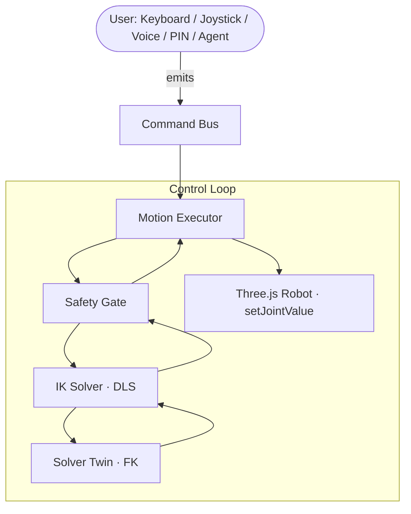

# Clove Arm

<div align="center">

**A browser-based 6-DOF robotic arm simulation and control platform**

Built for the IUT Techathon Nationals Hackathon Final Round by **Team Clover**

</div>

---

## Team

| Name                      | University              | Links                                                 |
| :------------------------ | :---------------------- | :---------------------------------------------------- |
| **Sadman Islam**          | Metropolitan University | [GitHub](https://github.com/amisadman)                |
| **Shah Samin Yasar**      | Metropolitan University | [Portfolio](https://shahsaminyasar.vercel.app/)       |
| **Ahmed Thousif Thisham** | Metropolitan University | [Portfolio](https://ahmedthousifportfolio.vercel.app) |

---

## What is Clove Arm?

Clove Arm is a complete robotic arm simulation that lets engineers visualize, manually control, validate, and autonomously operate a 6-DOF industrial robotic arm entirely inside a web browser — no physical hardware required.

Instead of testing experimental control software on expensive physical arms, Clove Arm provides a safe simulation environment where every motion passes through the same deterministic pipeline before execution. If it works here, it's ready for real hardware.

<div align="center">


</div>

---

## Phases

### Phase 1 — Visualization

The arm is loaded from a URDF file and rendered live in 3D. Joint states and end-effector position update in real time. The 6-key test panel is placed at the exact coordinates from `key.config.json`.

---

### Phase 2 — Manual Control

Four control methods share one motion pipeline: joint sliders, GUI joystick, keyboard, and direct target input. Every input produces the same `MotionCommand` object — the arm cannot tell which control surface sent it.

<div align="center">


_Joystick, keyboard shortcuts, and joint sliders in action_

</div>

| Key     | Action                  |
| :------ | :---------------------- |
| `W / S` | +X / −X                 |
| `A / D` | +Y / −Y                 |
| `Q / E` | +Z / −Z                 |
| `Shift` | Fine mode (×0.25 speed) |
| `H`     | Home position           |
| `?`     | Toggle keymap legend    |

---

### Phase 3 — Voice Control

Spoken commands are captured via the Web Speech API, parsed by a deterministic grammar, and routed through the same pipeline as manual inputs. The arm responds and confirms verbally.

<div align="center">


_Live transcript, parsed command, and spoken confirmation_

</div>

Supported commands include: _"move up"_, _"move left 5 centimeters"_, _"rotate base 30 degrees"_, _"press key 4"_, _"enter PIN 1 4 2 5 3 6"_, and **AI powered plain text/natural language support**.

---

### Phase 3B — Agentic Voice Control _(Bonus)_

Free-form natural language is interpreted by an LLM reasoning layer, converted into structured motion commands, validated by the safety gate, and executed. The arm responds in natural language — and speech — confirming what it understood and reporting the outcome.

> _"Move slightly above key 5 and press it twice."_
> _"Rotate the base 20 degrees then move toward the keypad."_

Ambiguous instructions trigger a clarifying question. Out-of-bounds commands are rejected with an explanation. AI output is never executed blindly.

---

### Phase 4 — Autonomous PIN Entry

Given a 6-digit PIN, the arm sequences autonomously through each key: hover → descend → touch → tolerance check (±5 mm) → retract → next digit. Every key press is validated and logged with its achieved error in millimetres.

<div align="center">


_Autonomous PIN sequence with per-key tolerance readout_

</div>

No hardcoded animations — every movement is computed by the same IK solver and motion pipeline used for manual control.

---

### Phase 5 — Electrical Schematic

A proof-of-concept circuit for a WiFi-controlled servo arm: ESP32 microcontroller, PCA9685 PWM driver, dual power rails, and labeled connections.

<div align="center">


_Wokwi circuit: ESP32 + PCA9685 driving 7 servo channels_

</div>

🔗 [View on Wokwi](https://wokwi.com/projects/469131631081158657)

---

## Architecture

The core design principle: **one motion pipeline, five triggers**.



Every command — manual, scripted, voice, or AI-generated — passes through the same deterministic safety gate before anything moves. This is the same guarantee you'd want before handing the pipeline to real hardware.

---

## Inverse Kinematics

IK is solved numerically using **Damped Least Squares** over all 7 joints.

Each iteration:

1. Compute the 3×7 Jacobian (numeric differentiation — perturb each joint by 0.0001 rad, measure tip displacement)
2. Compute tip error: `e = target − fk(q)`
3. Apply DLS update: `Δq = Jᵀ(JJᵀ + λ²I)⁻¹ · e` with `λ = 0.08`
4. Clamp joints to URDF limits
5. Repeat until `‖e‖ < 1 mm` or 30 iterations

Warm-starting from the previous frame's joint angles reduces jogging to 1–3 iterations, maintaining 60 fps. An invisible solver twin (cloned robot) runs all IK iterations without touching the rendered arm.

---

## Safety System

Every command is validated before execution:

| Check            | Detail                                                |
| :--------------- | :---------------------------------------------------- |
| Workspace bounds | Target z ≥ 0, radial reach ≤ 1.45 m                   |
| Reachability     | IK must converge within 5 mm                          |
| Joint limits     | Each joint clamped to URDF limits                     |
| Motion rate      | No single joint jumps > 1.5 rad without interpolation |

Rejected commands surface a human-readable reason in the UI and are never executed — including AI-generated commands.

---

## Remote Controller

Open `/controller` on any device to get a mobile joystick that drives the arm remotely via Socket.io.

<div align="center">


</div>

The controller emits the same `MotionCommand` objects as every other input mode. The arm cannot tell it apart from the keyboard.

🔗 [Controller Page Link](https://clove-arm.vercel.app/controller)

---

## Tech Stack

| Layer        | Technology                                  |
| :----------- | :------------------------------------------ |
| Frontend     | React, TypeScript, Vite                     |
| 3D Rendering | Three.js, React Three Fiber, Drei           |
| URDF Loading | urdf-loader                                 |
| Robotics     | Forward Kinematics, Damped Least Squares IK |
| Voice        | Web Speech API (STT + TTS)                  |
| Agentic AI   | LLM reasoning layer via Groq API            |
| Server       | Express, Socket.io                          |

---

## Setup Guide

```bash
# Clone
git clone https://github.com/amisadman/clove-arm_TeamClover.git

# Terminal 1 — Server
cd ./server
npm install
npm run dev

# Terminal 2 — Client
cd ./client
npm install
npm run dev

# Client ENV variable
VITE_GROQ_API_KEY=your_qroq_api_key_here
VITE_SERVER_URL=the_server_url

```

Open the URL shown by Vite. For the remote controller, open `{{CLIENT_URL}}/controller` on any device _(under the same WiFi IF SERVER IS RUNNING IN LOCALHOST)_.
